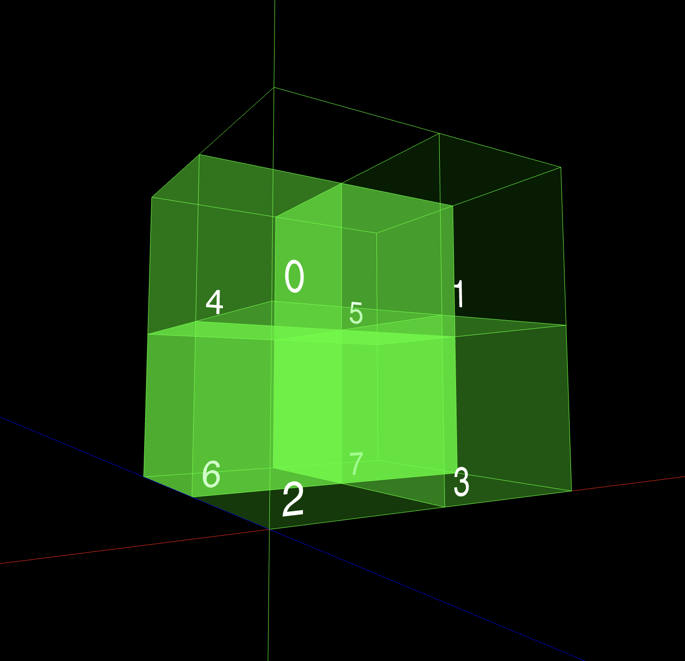

I was learning how we can do distributed RL training, saw karpathy posting [this](https://x.com/karpathy/status/1952076108565991588) and thought why not make a complete blog about what I learned so here it is.

The end goal of this blog is to explain clearly how to do distributed RL training, right now it contains explanations about fundamentals of distributed training, such as data parallelism, model parallelism, and tensor parallelism. Consider this as a part 1, where in the next blog I'll be explaining how we apply the techniques learned in the blog.

Doing RL is simply not easy from the resource/computation standpoint because there isn't just one model/optimizer states and gradients that we need to care of but the same model can be an actor, critic, reference policy and so on and we need to store them in our GPU. Doing RL even with 0.5B model with decent sequence length takes a LOT of GPU memory, which led me to understand how GPUs can work in a distributed manner (the part which I had always been ignoring).

## Manual Distributed Data Parallel

The simplest form of distributed training is distributed data parallel where **each GPU** has a copy of a model, but each GPU has different batches of data. Lets say we have batch_size = 64 and 2 GPUs, and a model. The model's parameters will be replicated across both GPU. GPU1 will get (1, batch_size/2) and GPU2 will get (batch_size/2 , batch_size) data, each GPU will process on its own, find it's own loss and find its own gradients and then sum those gradients over both the GPUs and average it (if needed), the averaged gradients will be replicated across both the GPUs and each will perform optimizer.step() on its own and end up with same set of parameters.

Let's do manual distributed data parallel to see how it works under the hood with the help of a toy model.

```python
import os

import torch
import torch.distributed as dist
import torch.nn as nn

## ----------------- SETUP ----------------------------
rank = int(os.environ["RANK"])
world_size = int(os.environ["WORLD_SIZE"]) # total number of GPUs
local_rank = int(os.environ["LOCAL_RANK"]) # unique id for this GPU
device = 'cuda' if torch.cuda.is_available() else 'cpu'
backend = 'nccl' if device == 'cuda' else 'gloo'
dist.init_process_group(backend=backend,  world_size=world_size)
#torch.cuda.set_device(local_rank) # turn this on if you have GPU
## ----------------- SETUP ----------------------------

inp = [torch.arange(1.,9.).reshape(2,4), torch.arange(9.,17.).reshape(2,4)]


class ToyModel(nn.Module):
    def __init__(self):
        super().__init__()
        self.net1 = nn.Parameter(torch.arange(1.,5.).reshape(1,4))
    def forward(self,x):
        return x @ self.net1.T

local_data = inp[local_rank] # this way different gpus will get different data

model = ToyModel()
optimizer = torch.optim.AdamW(model.parameters(), lr=1e-6)

for i in range(1):
    predicted = model(local_data)
    original = torch.randn_like(predicted)

    loss = (original - predicted)**2
    loss = loss.sum(dim=0)
    loss /= predicted.shape[0]
    print(loss)
    optimizer.zero_grad()
    loss.backward()

    print(f' RANK {dist.get_rank() }\n parameters\n {model.net1.grad} ')
    dist.all_reduce(model.net1.grad, op=dist.ReduceOp.SUM)
    model.net1.grad /= world_size
    print(f' AFTER ALL REDUCE \n RANK {dist.get_rank() }\n parameters\n {model.net1.grad} ')

    # do the optimizer.step
    optimizer.step()
dist.destroy_process_group()
```

run the code with `torchrun --node_rank=0 --nproc_per_node=2 --nnodes=1 --standalone test2.py`
`torchrun` will start different processes equals to the number specified in --nproc_per_node i.e 2 and this line `dist.init_process_group(backend=backend,  world_size=world_size)` will create a process group where ranks in the groups communicate with each other by using collectives (explained below). Each process will also get one rank, we can access it's rank using `local_rank = int(os.environ["LOCAL_RANK"])` and can assign gpu to each process using `torch.cuda.set_device(local_rank)` for now I'll be commenting our because, we can carry out these simple codes in CPU.

Now, we define our model structure, it's a simply matrix multiplication (similar to nn.Linear with bias=False) and assign different data to different ranks using `local_data = inp[local_rank]`, we process different data on different process calculate loss, do backward and do
` dist.all_reduce(model.net1.grad, op=dist.ReduceOp.SUM)` it will first collect all the model.net1.grad from all the GPUs and sum it (provided by dist.ReduceOp.SUM) and transfer the summed result to each GPUs (thus the name reduce). The operation all_reduce should be intuitive by now.

This all_reduce is a collective operation performed by the `backend` i.e either 'nccl' or 'gloo'.
'nccl' is mostly used for GPUs whereas 'gloo' can run in CPUs as well. Under the hood these backend implement the logic on how these collectives operations need to be implemented. all_reduce is one of many collective operations provided by the backend. Please late a look at the picture below to understand how these work.


Image source: [Writing Distributed Applications with PyTorch](https://docs.pytorch.org/tutorials/intermediate/dist_tuto.html)

You can take a look at this [source](https://docs.pytorch.org/tutorials/intermediate/dist_tuto.html) if you want to understand how these collectives work under the hood.

### Pytorch's DistributedDataParallel

The same function can be carried out by wrapping our model within pytorch's DistributedDataParallel and we don't have to call all_reduce manually, pytorch automatically takes care of that when we call loss.backward().

```python
import os

import torch
import torch.distributed as dist
import torch.nn as nn
from torch.nn.parallel import DistributedDataParallel as DDP
## ----------------- SETUP ----------------------------
rank = int(os.environ["RANK"])
world_size = int(os.environ["WORLD_SIZE"])
local_rank = int(os.environ["LOCAL_RANK"])
device = 'cuda' if torch.cuda.is_available() else 'cpu'
backend = 'nccl' if device == 'cuda' else 'gloo'
dist.init_process_group(backend=backend,  world_size=world_size)
## ----------------- SETUP ----------------------------

inp = [torch.arange(1.,9.).reshape(2,4), torch.arange(9.,17.).reshape(2,4)]


class ToyModel(nn.Module):
    def __init__(self):
        super().__init__()
        self.net1 = nn.Parameter(torch.arange(1.,5.).reshape(1,4))
    def forward(self,x):
        return x @ self.net1.T

local_data = inp[local_rank] # will get data based on its rank

model = ToyModel()
ddp_model = DDP(model)

optimizer = torch.optim.AdamW(ddp_model.parameters(), lr=1e-6)

for i in range(1):
    predicted = ddp_model(local_data)
    original = torch.randn_like(predicted)

    print(local_data)
    loss = (original - predicted)**2
    loss = loss.sum(dim=0)
    loss /= predicted.shape[0]
    print('loss',loss)

    optimizer.zero_grad()

    loss.backward()

    # dist.all_reduce(model.net1.grad, op=dist.ReduceOp.SUM)
    print(f' AFTER ALL REDUCE \n RANK {dist.get_rank() }\n parameters\n { ddp_model.module.net1.grad} ')
    # do the optimizer.step
    optimizer.step()
dist.destroy_process_group()
```

We need to take care of saving and loading the models which can be referred to [this link](https://docs.pytorch.org/tutorials/intermediate/ddp_tutorial.html)

### Fully Sharded Data Parallel (FSDP)

Let's first remind ourselves about the drawbacks of DDP. DDP has a copy of whole model weights, gradients, and optimizer in each GPU. When models get bigger it won't completely fit in One GPU's memory. We don't want to only fit model's weight on a GPU, we need to fit it's gradients, and the biiiiiig optimizer which contains twice the parameters as model's weight.

How about distributing parameters on different GPUs and then gathering the required parameters when doing the specific operation. This is exactly what Fully Sharded Data Parallel does.

Let's consider we have a layer that has a flat weight matrix and 3 GPUs, we divide 1/3 of the weights into each GPU as shown in the picture below and pass different batch to each GPU so that it can perform computation simultaneously.


Image source: [The SECRET Behind ChatGPT's Training That Nobody Talks About | FSDP Explained](https://www.youtube.com/watch?v=6pVn6khIgiI)

Data reaches the GPU but GPU doesn't have the full weight to complete the computation, so each GPU calls all_gather collective to collect weights from all the GPUs. After all gather all 3 GPUs will have the full weight `[0..1024]` and it can do the computation as shown in the figure below.

After computing the activations it instantly frees up the GPU memory. Next, is the case of backward pass.

Similar to image above, it first all gathers the weights and compute the gradients, and reduce scatter so that each GPU only has gradients for their respective shard and then when we do optimizer.step() it will only update it's respective shard of optimizer. See how we shard weights, gradients, and optimizer across GPUs but only gather weights, this helps a lot. BUT a GPU should have memory to at least store model's full weights.
If you want to visually see how FSDP work, this [video](https://www.youtube.com/watch?v=6pVn6khIgiI) might be very helpful.

We'll see how FSDP shards weight in detail with code below along with Tensor Parallelism explained in the next section.

### Tensor Parallelism

Now let's shard the computation. Previously, we sharded weights but in order to do computation (matrix multiplication), we all gathered all the parameters in each GPU then do the computation. Lets say we have very big parameter in our `net1`in the above example, so we shard that parameter into available GPUs, but when we do the .forward() call all weights need to be gathered inorder to do computation, so there's a requirement that `net1`'s weight **MUST** fit in each GPU, what if it's too big that it can't fit in a single GPU. There's a solution: Tensor Parallelism

As the name suggest we shard the matrix either row-wise or column-wise. Before understanding it would be easier to understand Tensor Parallelism if we remember some properties of matrix multiplication.

```
A = [  1   2   3   4
       5   6   7   8
       9  10  11  12
      13  14  15  16 ]

X = [ 1  0  0  0
      0  1  0  0 ]

# Shard A column wise, suppose we have 2 GPUS each half is stored in each GPU

A1 = [  1   2
        5   6
        9  10
       13  14 ]


A2 = [  3   4
        7   8
       11  12
       15  16 ]

X @ A1 = [ 1   2
           5   6 ]
X @ A2 = [ 3   4
           7   8 ]

# we can simply concatenate the two halves to get the full output

X @ A = [ 1   2    3   4
	      5   6   7   8 ]


```

Similarly, when we shard A row-wise,

```

X @ A = [X @ A1 + X @ A2] # NOTE: "A" should be sharded such that its halves can be multiplied with X.
```

Let's understand this with the help of this famous as well as the crucial implementation.
This is a sample code for FFN used in almost all the models these days. Since we apply gating mechanism here instead of using two weights we use three weights.

```python
# forward in the FeedForward layer
def forward(self, x):
    return self.w2(F.silu(self.w1(x)) * self.w3(x))
```

Assume we have 2 GPUs. We have three weights.

```
w1's shape = w3's shape =  (768, 1024)
w2's shape = (1024, 768)
```

We first shard w1 and w3's weight column-wise and w2 row wise

```
GPU1 will get w1's (768, 512). # call it gpu1_w1
GPU1 will get w3's (768, 512). # call it gpu1_w3 and so on.
GPU1 will get w2's (512, 768)

------------------------------
GPU2 will get w1's (768, 512).
GPU2 will get w3's (768, 512).
GPU2 will get w2's (512, 768)

```

we have input x of shape (3,768) that is replicated across both the GPUs.

```
In GPU1, we can perform these operations below simultaneously,

a = x @ gpu1_w1
b = x @ gpu1_w3

since there was element-wise multplication between a and b ( from F.silu(self.w1(x)) * self.w3(x))

GPU1 can simply do c = a * b

then do

d1 = c @ gpu1_w2

--------------------------------------------------
While GPU1 was doing all these operations above, GPU2 was doing the same operation (at the same time) for it's own weights

a = x @ gpu2_w1
b = x @ gpu2_w3

since there was element-wise multplication between a and b ( from F.silu(self.w1(x)) * self.w3(x))

GPU1 can simply do c = a * b

then do

d2 = c @ gpu2_w2

```

Afterwards, we can simply do all_reduce that will add the d1 + d2 and provide GPU1 and GPU2 with the summed result.

Similarly, we can do row-wise and column-wise sharding for attention as well which can be seen in the illustration below.


Both should be easy to understand, if not please take a look at the [source](https://insujang.github.io/2024-01-11/tensor-parallelism-and-sequence-parallelism-detailed-analysis/)

Enough of theory, how do we do that in using pytorch?
--------> **DTensor** <--------

What is DTensor?

> PyTorch DTensor offers simple and flexible tensor sharding primitives that transparently handles distributed logic,

Basically, it aids sharding/replicating tensors in pytorch.
This is what we use under the hood in pytorch's Tensor Parallelism and FSDP2.

Couple of things we need to understand properly are: device_mesh and placements.

For now lets consider we have 2 GPUs, with DeviceMesh of simple 1D mesh [0,1]. It simply denotes how GPUs are structured in a grid (more on 2D, 3D mesh later) and both 0 and 1 GPU will be used for Tensor Parallelism.

#### Placements

- `Shard`: Tensor sharded on the tensor dimension `dim` on the devices of the `DeviceMesh` dimension
- `Replicate`: Tensor replicated on the devices of the `DeviceMesh` dimension
- `Partial`: Tensor is pending reduction on the devices of the `DeviceMesh` dimension

```python
import os
import torch
import os
from torch import distributed as dist
import torch.nn as nn
from torch.distributed.device_mesh import init_device_mesh
# from torch.distributed.fsdp import FullyShardedDataParallel as FSDP, ShardingStrategy
from torch.distributed._composable.fsdp import fully_shard
from torch.distributed.tensor.parallel import parallelize_module, ColwiseParallel, RowwiseParallel, SequenceParallel, PrepareModuleInput
from torch.distributed._tensor import Shard, Replicate, distribute_tensor, DTensor


device = 'cuda' if torch.cuda.is_available() else 'cpu'
backend = 'nccl' if device == 'cuda' else 'gloo'

rank = int(os.environ["RANK"])
world_size = int(os.environ["WORLD_SIZE"])
local_rank = int(os.environ["LOCAL_RANK"])


dist.init_process_group(backend=backend, world_size=world_size)

if device == 'cuda':
    torch.cuda.set_device(local_rank)


mesh = init_device_mesh('cpu', (2,), mesh_dim_names=["TP"])

x = torch.arange(1, 9).reshape(2,4)
y = torch.arange(9, 17).reshape(2,4)

x_local = distribute_tensor(x, device_mesh = mesh['TP'], placements=[Replicate()])

y_local = distribute_tensor(y, mesh['TP'], placements=[Replicate()])

print(f'RANK {dist.get_rank()} \n X local {x_local} \n Y local {y_local} \n MM_local {x_local @ y_local.T}')

```

x and y are of type torch.Tensor and with distrbute_tensor they will be sharded/replicated based on the placements type over device_mesh. As you can see, we've replicated x and y so both of these will have the same output in both GPUs

```

RANK 1
 X local DTensor(local_tensor=tensor([[1, 2, 3, 4],
        [5, 6, 7, 8]]), device_mesh=DeviceMesh('cpu', [0, 1], mesh_dim_names=('TP',)), placements=(Replicate(),))
 Y local DTensor(local_tensor=tensor([[ 9, 10, 11, 12],
        [13, 14, 15, 16]]), device_mesh=DeviceMesh('cpu', [0, 1], mesh_dim_names=('TP',)), placements=(Replicate(),))
 MM_local DTensor(local_tensor=tensor([[110, 150],
        [278, 382]]), device_mesh=DeviceMesh('cpu', [0, 1], mesh_dim_names=('TP',)), placements=(Replicate(),))

RANK 0
 X local DTensor(local_tensor=tensor([[1, 2, 3, 4],
        [5, 6, 7, 8]]), device_mesh=DeviceMesh('cpu', [0, 1], mesh_dim_names=('TP',)), placements=(Replicate(),))
 Y local DTensor(local_tensor=tensor([[ 9, 10, 11, 12],
        [13, 14, 15, 16]]), device_mesh=DeviceMesh('cpu', [0, 1], mesh_dim_names=('TP',)), placements=(Replicate(),))
 MM_local DTensor(local_tensor=tensor([[110, 150],
        [278, 382]]), device_mesh=DeviceMesh('cpu', [0, 1], mesh_dim_names=('TP',)), placements=(Replicate(),))
```

Take this code now.

```python
x = torch.arange(1, 9).reshape(2,4)
y = torch.arange(9, 17).reshape(2,4)

x_local = distribute_tensor(x, device_mesh = mesh['TP'], placements=[Replicate()])

y_local = distribute_tensor(y, mesh['TP'], placements=[Shard(0)])

print(f'RANK {dist.get_rank()} Y local {y_local} \n MM_local {x_local @ y_local.T}')

```

we replicate x but we shard y so, y will be halved and saved with type Shard(0) in two GPUs with different value and x will be same in both GPUs. we multiply both and the output will be of type Shard(1) (why? because of transpose, the shard type is changed) remember this, this might be helpful later on. Here's the output

```
RANK 1 Y local DTensor(local_tensor=tensor([[13, 14, 15, 16]]), device_mesh=DeviceMesh('cpu', [0, 1], mesh_dim_names=('TP',)), placements=(Shard(dim=0),))
 MM_local DTensor(local_tensor=tensor([[150],
        [382]]), device_mesh=DeviceMesh('cpu', [0, 1], mesh_dim_names=('TP',)), placements=(Shard(dim=1),))

RANK 0 Y local DTensor(local_tensor=tensor([[ 9, 10, 11, 12]]), device_mesh=DeviceMesh('cpu', [0, 1], mesh_dim_names=('TP',)), placements=(Shard(dim=0),))
 MM_local DTensor(local_tensor=tensor([[110],
        [278]]), device_mesh=DeviceMesh('cpu', [0, 1], mesh_dim_names=('TP',)), placements=(Shard(dim=1),))
```

Let's do some example similar to this code.

```python
def forward(self, x):
    return self.w2(F.silu(self.w1(x)) * self.w3(x))
```

```python

x = distribute_tensor(torch.ones(3, 2), device_mesh = mesh['TP'], placements=[Replicate()])

w1 = torch.arange(1., 9.).reshape(2,4)
w3 = torch.arange(9., 17.).reshape(2,4)
w2 = torch.tril(torch.ones(4, 2), diagonal=-1)

w1_local = distribute_tensor(w1, device_mesh = mesh['TP'], placements=[Shard(-1)])
w3_local = distribute_tensor(w3, device_mesh = mesh['TP'], placements=[Shard(-1)])
w2_local = distribute_tensor(w2, device_mesh = mesh['TP'], placements=[Shard(0)])


# print(f'RANK {dist.get_rank()} \n X local {x_local} \n Y local {y_local} \n MM_local {x_local @ y_local.T}')
c = (x @ w1_local) * (x @ w3_local)
d = c @ w2_local

# collect d from both GPUs
d_collect = d.redistribute(placements=[Replicate()])

print(f'RANK {dist.get_rank()} w1.shape {w1_local.to_local().shape} \n  w3.shape {w3_local.to_local().shape} \n w2.shape {w2_local.to_local().shape} c values \n {c}, \n d values \n{d} \n d collect \n {d_collect}')

```

```
RANK 1 w1.shape torch.Size([2, 2])
  w3.shape torch.Size([2, 2])
 w2.shape torch.Size([2, 2]) c values
 DTensor(local_tensor=tensor([[260., 336.],
        [260., 336.],
        [260., 336.]]), device_mesh=DeviceMesh('cpu', [0, 1], mesh_dim_names=('TP',)), placements=(Shard(dim=1),)),
 d values
DTensor(local_tensor=tensor([[596., 596.],
        [596., 596.],
        [596., 596.]]), device_mesh=DeviceMesh('cpu', [0, 1], mesh_dim_names=('TP',)), placements=(Partial(sum),))
 d collect
 DTensor(local_tensor=tensor([[788., 596.],
        [788., 596.],
        [788., 596.]]), device_mesh=DeviceMesh('cpu', [0, 1], mesh_dim_names=('TP',)), placements=(Replicate(),))
        ----------------------------------------------------------
RANK 0 w1.shape torch.Size([2, 2])
  w3.shape torch.Size([2, 2])
 w2.shape torch.Size([2, 2]) c values
 DTensor(local_tensor=tensor([[132., 192.],
        [132., 192.],
        [132., 192.]]), device_mesh=DeviceMesh('cpu', [0, 1], mesh_dim_names=('TP',)), placements=(Shard(dim=1),)),
 d values
DTensor(local_tensor=tensor([[192.,   0.],
        [192.,   0.],
        [192.,   0.]]), device_mesh=DeviceMesh('cpu', [0, 1], mesh_dim_names=('TP',)), placements=(Partial(sum),))
 d collect
 DTensor(local_tensor=tensor([[788., 596.],
        [788., 596.],
        [788., 596.]]), device_mesh=DeviceMesh('cpu', [0, 1], mesh_dim_names=('TP',)), placements=(Replicate(),))
```

as you can see d has two different values with placement type Partial and when we call redistribute on d with Replicate() type the result is all gathered (summed) and will be same on both GPU.

This was all manual Tensor Parallelism. We don't go on writing these for all the matrix multiplications so we use some different method which implements the same logic under the hood.

#### ColwiseParallel()

> Partition a compatible nn.Module in a column-wise fashion.

NOTE: ColwiseParallel() only operates on nn.Linear() and nn.Embedding() module.

```python

class ToyModel(nn.Module):
    def __init__(self):
        super(ToyModel, self).__init__()

        self.w1 = nn.Linear(2,4, bias=False)
        self.w3 = nn.Linear(2,4, bias=False)
        self.w2 = nn.Linear(4,2, bias=False)

        with torch.no_grad():
            self.w1.weight = nn.Parameter(torch.arange(1., 9.).reshape(4,2)) # cause weight will have shape opposite of whats specified in nn.Linear()
            self.w3.weight = nn.Parameter(torch.arange(9., 17.).reshape(4,2))
            self.w2.weight = nn.Parameter(torch.tril(torch.ones(2,4), diagonal=-1))

    def forward(self, x):
        return self.w2(self.w1(x) * self.w3(x))

model = ToyModel()

tp_plan = {
    "w1" : ColwiseParallel(),
    "w2" : RowwiseParallel(),
    "w3" : ColwiseParallel()
}

model = parallelize_module(model, mesh['TP'], tp_plan)
x = distribute_tensor(torch.ones(3, 2), mesh['TP'], placements=[Replicate()]) # this is simply a tensor because ColwiseParallel will automatically convert it's input from torch.Tensor to torch.DTensor
out = model(x)


print(f'RANK {dist.get_rank()} w1.weight \n {model.w1.weight}, \n MM values \n{model.w1(x) * model.w3(x)} output values \n{out} \n')
```

```
RANK 1 w1.weight
 DTensor(local_tensor=tensor([[5., 6.],
        [7., 8.]]), device_mesh=DeviceMesh('cpu', [0, 1], mesh_dim_names=('TP',)), placements=(Shard(dim=0),)),
 MM values
tensor([[297., 465.],
        [297., 465.],
        [297., 465.]], grad_fn=<MulBackward0>) output values
AsyncCollectiveTensor(tensor([[ 0., 57.],
        [ 0., 57.],
        [ 0., 57.]]))

RANK 0 w1.weight
 DTensor(local_tensor=tensor([[1., 2.],
        [3., 4.]]), device_mesh=DeviceMesh('cpu', [0, 1], mesh_dim_names=('TP',)), placements=(Shard(dim=0),)),
 MM values
tensor([[ 57., 161.],
        [ 57., 161.],
        [ 57., 161.]], grad_fn=<MulBackward0>) output values
AsyncCollectiveTensor(tensor([[ 0., 57.],
        [ 0., 57.],
        [ 0., 57.]])
```

This code tries to exactly do the task that we did previously, the logic is the same but the output is different because of how the arranged weights is transposed and sharded.

Let's me explain how ColwiseParallel works internally.

- It takes input x, if it's a tensor it will make it a DTensor and if not in the desired layout it will redistribute it to be the desired layout.

```python
        self.input_layouts = (input_layouts or Replicate(),)
        self.output_layouts = (output_layouts or Shard(-1),)
        self.desired_input_layouts = (Replicate(),)
```

```python
    def _prepare_input_fn(
        input_layouts, desired_input_layouts, mod, inputs, device_mesh
    ):
        # TODO: figure out dynamo support for instance method and switch this to instance method

        # annotate module input placements/sharding with input_layouts
        input_tensor = inputs[0]
        if not isinstance(input_tensor, DTensor):
            input_tensor = DTensor.from_local(
                input_tensor, device_mesh, input_layouts, run_check=False
            )

        # transform the input layouts to the desired layouts of ColwiseParallel
        if input_layouts != desired_input_layouts:
            input_tensor = input_tensor.redistribute(
                placements=desired_input_layouts, async_op=True
            )
        return input_tenso
```

- ColwiseParallel will shard the module's weights on 0'th dimension not 1, why??

```python

    def _partition_linear_fn(self, name, module, device_mesh):
        # colwise shard weight/bias to Shard(0), weight be Shard(0)
        # means Colwise as Linear is input * weight^T + bias, where
        # weight would become Shard(1)
        for name, param in module.named_parameters():
            dist_param = nn.Parameter(
                distribute_tensor(
                    param, device_mesh, [Shard(0)], src_data_rank=self.src_data_rank
                )
            )
            module.register_parameter(name, dist_param)
```

- because under the hood in nn.Linear, the operation is x @ w.T, the weights are transposed, so
- weights are sharded on dim=0, but output will be Shard(-1) because we multiply with the transpose weight (see example above where we implemented MM with transposed weights), and by default use_local_output is True which will convert the DTensor back to torch.Tensor

This is a part of code from pytorch's ColwiseParallel() [here](https://github.com/pytorch/pytorch/blob/134179474539648ba7dee1317959529fbd0e7f89/torch/distributed/tensor/parallel/style.py#L89) shows the default input and output layouts for ColwiseParallel().

#### RowwiseParallel()

it works exactly the opposite of ColwiseParallel(), it shards weights on dim=1, i.e Shard(dim=1)

```python
        self.input_layouts = (input_layouts or Shard(-1),)
        self.output_layouts = (output_layouts or Replicate(),
```

and it's desired layout is Shard(-1).

That's it, we need to take care of three things.

1. what input it expects (i.e Shard() or Replicate())
2. what it outputs (i.e Shar() or Replicate())
3. How it shards it's module weights.

#### SequenceParallel()

It generally operates on the sequence dimension. Say the activations are of shape B,T,C = batch_size, sequence_length, embedding dimension.

It will shard the sequence dimension T. There is no sharding of weight in this SequenceParallel(). It is applied to the LayerNorm()/RMSNorm() it will split on T and calculate mean/std based on the given T, there's no need for communication because mean/std are calculated on C'th dimension and don't depend on T.

However, the **output** of LayerNorm/RMSNorm is typically **all-gathered** across the **T** shards before it is consumed by the next layer (e.g., an attention or MLP block) (more on this below)
self.sequence_sharding = (Shard(sequence_dim)

```python
    def _prepare_input_fn(sequence_sharding, mod, inputs, device_mesh):
        input_tensor = inputs[0]
        if isinstance(input_tensor, DTensor):
            # if the passed in input DTensor is not sharded on the sequence dim, we need to redistribute it
            if input_tensor.placements != sequence_sharding:
                input_tensor = input_tensor.redistribute(
                    placements=sequence_sharding, async_op=True
		return input_tens
```

#### Tensor Parallelism on Transformers Model

Let's apply what we learned above in a transformers model. I won't be providing the output for this but will only explain what it's doing. The code below is taken from [here](https://docs.pytorch.org/tutorials/intermediate/TP_tutorial.html)

```python
import os
import torch
import os
from torch import distributed as dist
import torch.nn as nn
from torch.distributed.device_mesh import init_device_mesh
# from torch.distributed.fsdp import FullyShardedDataParallel as FSDP, ShardingStrategy
from torch.distributed._composable.fsdp import fully_shard
from torch.distributed.tensor.parallel import parallelize_module, ColwiseParallel, RowwiseParallel, SequenceParallel, PrepareModuleInput
from torch.distributed._tensor import Shard, Replicate, distribute_tensor, DTensor

from llama2_model import Transformer, ModelArgs


# import warnings # ignore all warning messages
# warnings.filterwarnings("ignore")

# Code for helping init process group
device = 'cuda' if torch.cuda.is_available() else 'cpu'
backend = 'nccl' if device == 'cuda' else 'gloo'

rank = int(os.environ["RANK"])
world_size = int(os.environ["WORLD_SIZE"])
local_rank = int(os.environ["LOCAL_RANK"])

# print('local rank', local_rank)

dist.init_process_group(backend=backend, world_size=world_size)

if device == 'cuda':
    torch.cuda.set_device(local_rank)

simple_llama2_config = ModelArgs(dim=16, n_layers=1, n_heads=4, vocab_size=64)

model = Transformer.from_model_args(simple_llama2_config).to(device)
# model.init_weights()

# """
# mesh = init_device_mesh('cpu', (2, 4), mesh_dim_names=["FSDP", "TP"])

mesh = init_device_mesh('cpu', (2,), mesh_dim_names=["TP"])

layer_tp_plan = {
    # Now the input and output of SequenceParallel has Shard(1) layouts,
    # to represent the input/output tensors sharded on the sequence dimension
    "attention_norm": SequenceParallel(),
    "attention": PrepareModuleInput(
        input_layouts=(Shard(1), Replicate()),
        desired_input_layouts=(Replicate(), Replicate()),
    ),
    "attention.wq": ColwiseParallel(use_local_output=False),
    "attention.wk": ColwiseParallel(use_local_output=False),
    "attention.wv": ColwiseParallel(use_local_output=False),
    "attention.wo": RowwiseParallel(output_layouts=Shard(1)),
    "ffn_norm": SequenceParallel(),
    "feed_forward": PrepareModuleInput(
        input_layouts=(Shard(1),),
        desired_input_layouts=(Replicate(),),
    ),
    "feed_forward.w1": ColwiseParallel(),
    "feed_forward.w2": RowwiseParallel(output_layouts=Shard(1)),
    "feed_forward.w3": ColwiseParallel(),
}
# Apply TP
for layer_id, transformer_block in enumerate(model.layers):
    # layer_tp_plan = {...}  # i.e. the plan we just generated

    parallelize_module(
        module=transformer_block,
        device_mesh=mesh['TP'],
        parallelize_plan=layer_tp_plan,
    )

model = parallelize_module(
    model,
    mesh['TP'],
    {
        "tok_embeddings": RowwiseParallel(
            input_layouts=Replicate(),
            output_layouts=Shard(1),
        ),
        "norm": SequenceParallel(),
        "output": ColwiseParallel(
            input_layouts=Shard(1),
            output_layouts=Replicate()
        ),
    }
)
```

you can pass input x through model() and inspect where the weights for each modules are stored and what the output will be.

All we need to change/understand is the parallelize_plan. let's understand the sequence of parallelization in our model that we have created above with the help of Colwise Rowwise and Sequence Parallel.

Step 1

```python
        "tok_embeddings": RowwiseParallel(
            input_layouts=Replicate(),
            output_layouts=Shard(1),
        ),
```

x = (B,T)
out = tok_embeddings(x)
tok_embeddings.weight is sharded by dim=0, output must be replicate but we apply output_layouts=Shard(1) cause next we apply SequenceParallel that expects Shard(1) as input

so out is of shape (B,T/2) its is sharded by dim=1 but its a torch.Tensor if GPU=2

Step 2

```python
    "attention_norm": SequenceParallel(),
```

out = attention_norm(out)
converts out(B,T/2, C) which is a torch.Tensor to Shard(1) with prepare_input_fn. SequenceParallel is applied (no weight sharding), only applies LayerNorm/RMSNorm on T/2 tokens in each GPUs. no change of output layout i.e its still Shard(1) of shape B,T/2,C

Step 3

```python
    "attention": PrepareModuleInput(
        input_layouts=(Shard(1), Replicate()),
        desired_input_layouts=(Replicate(), Replicate()),
    ),

```

attention expects whole sequence so convert Shard(1) to Replicate(). under the hood out is combined to form (B,T,C) from B,T/2, C and replicate to both GPUs. Thats what PrepareModuleInput does. (Shard(1), Replicate()) is for different inputs to the attention module Shard(1) is for x and Replicate() is for freq_cis

Step 4

```python
    "attention.wq": ColwiseParallel(use_local_output=False),
    "attention.wk": ColwiseParallel(use_local_output=False),
    "attention.wv": ColwiseParallel(use_local_output=False),
```

apply Shard(0) to attention.wq.weight, but output is Shard(-1) (why? already explained above).

Step 5

```python
"attention.wo": RowwiseParallel(output_layouts=Shard(1))
```

Expects input to be Shard(-1) which is correct, should output replicate (after doing all reduce of the partial sum) but instead converts to Shard(1) because next we apply SequenceParallelism for ffn_norm.

Other steps should be straightforward, follow the sequence described below. Finally the output (B,T,vocab_size) is replicated across both the GPUs.

In pytorch's Tensor Parallel docs they suggest also adding loss parallel, because replicating the output logits which is of size (B,T,vocab_size) can be expensive. The only change we need to do is keep the use_local_output which will make the output of that output module to be DTensor.

```python
model = parallelize_module(
    model,
    tp_mesh,
    {
        "tok_embeddings": RowwiseParallel(
            input_layouts=Replicate(),
            output_layouts=Shard(1),
        ),
        "norm": SequenceParallel(),
        "output": ColwiseParallel(
            input_layouts=Shard(1),
            # use DTensor as the output
            use_local_output=False,
        ),
    },
)
```

and apply loss_parallel() context.

```python
import torch.nn.functional as F
from torch.distributed.tensor.parallel import loss_parallel

pred = model(input_ids)
with loss_parallel():
    # assuming pred and labels are of the shape [batch, seq, vocab]
    loss = F.cross_entropy(pred.flatten(0, 1), labels.flatten(0, 1))
    loss.backward()
```

I don't seem to understand this, because they don't provide enough explanation on their [page](https://docs.pytorch.org/tutorials/intermediate/TP_tutorial.html).

My assumption is that each gpus will have (B,T,vocab_size/2) matrix, loss calculation depends on the full vocab_size cause we need to convert the logits into probabilities using softmax function. What they could be doing is calculate the local sum of all e^(x) in vocab_size do all_reduce and then calculate loss.

### Device mesh

#### 2D mesh

It's very important that we have no confusion on how device mesh works, and how TP and FSDP works using the device mesh. (it has haunted for a day, because I did not understand it properly)

let's first start with a 2D mesh and apply tensor parallelism.
our original mesh will look like this

```
[[0,1],
[2,3]]
```

```python
mesh = init_device_mesh('cpu', (2, 2), mesh_dim_names=["FSDP", "TP"])

layer_tp_plan = {
    # Now the input and output of SequenceParallel has Shard(1) layouts,
    # to represent the input/output tensors sharded on the sequence dimension
    "attention_norm": SequenceParallel(),
    "attention": PrepareModuleInput(
        input_layouts=(Shard(1), Replicate()),
        desired_input_layouts=(Replicate(), Replicate()),
    ),
    "attention.wq": ColwiseParallel(use_local_output=False),
    "attention.wk": ColwiseParallel(use_local_output=False),
    "attention.wv": ColwiseParallel(use_local_output=False),
    "attention.wo": RowwiseParallel(output_layouts=Shard(1)),
    "ffn_norm": SequenceParallel(),
    "feed_forward": PrepareModuleInput(
        input_layouts=(Shard(1),),
        desired_input_layouts=(Replicate(),),
    ),
    "feed_forward.w1": ColwiseParallel(),
    "feed_forward.w2": RowwiseParallel(output_layouts=Shard(1)),
    "feed_forward.w3": ColwiseParallel(),
}
# Apply TP
for layer_id, transformer_block in enumerate(model.layers):
    # layer_tp_plan = {...}  # i.e. the plan we just generated

    parallelize_module(
        module=transformer_block,
        device_mesh=mesh['TP'],
        parallelize_plan=layer_tp_plan,
    )

model = parallelize_module(
    model,
    mesh['TP'],
    {
        "tok_embeddings": RowwiseParallel(
            input_layouts=Replicate(),
            # output_layouts=Shard(1),
        ),
        "norm": SequenceParallel(),
        "output": ColwiseParallel(
            input_layouts=Shard(1),
            output_layouts=Replicate()
        ),
    }
)
```

we apply TP on only the TP mesh `mesh['TP']`
but what is the output of `mesh['TP']` ?

there could be different ways to understand this, but I understand it this way.
Assume we are in process 0, i.e
our original mesh is `mesh['FSDP','TP']`, we try to get `mesh['TP']` where FSDP is not there so lets draw a line across 'FSDP' dimensions (0th and 1st) and see which TP sub-matrix falls in the drawn line. since we were in process 0, submatrix `[0,1]` is chosen and our process 0 will only `[0,1]` when we output `mesh['TP']` and ignore others. We'll get the same when we are on process 1, but we'll get `[2,3]` when we're on either 2 or 3 processes.

so the simple logic is to draw line across dimension that is not in the specified mesh i.e FSDP in this case, and see on which submatrix our current process falls. It's better to get a pen and paper and understand it deeply.


We pass this mesh to parallelize_module that takes in only 1D mesh and applies the Sharding plan across that 1D mesh, For example, if we are in process 0, the weights of size (8,8) are sharded across 0 and 1 GPUs so each gpu will get (4,8) (assume Shard(0)) and if we're on process 2 weights are sharded across 2,3.

```python
    parallelize_module(
        module=transformer_block,
        device_mesh=mesh['TP'],
        parallelize_plan=layer_tp_plan,
    )
```

now let's apply the FSDP sharding

```python

	for layer in model.layers:
		fully_shard(layer, mesh=mesh['FSDP'])

	fully_shard(model, mesh=mesh['FSDP'])
```

As we did above (drawing line and getting submatrix), process 0 will see mesh['FSDP'] = [0,2]
and process 1 will see [1,3].

fully_shard takes two types of mesh 1D, and 2D mesh. Since we have 1D mesh in this case, it will shard the weights across the 1D mesh with Shard(0) placement. i.e let's say we're on process 0, 0 already had (4,8) matrix, and when we apply fully_shard the dimension 0 is again split and process 0 will get (2,8) matrix and it's other half will be stored in process 2. If you're confused please bear with me, we'll see with examples on 3D mesh below.

#### 3D mesh



```python
[[[0,1],
[2,3]]

[[4,5],
[6,7]]]
```

```python
mesh = init_device_mesh('cpu', (2, 2, 2), mesh_dim_names=["DDP", "FSDP", "TP"])
```

We apply the same TP plan with mesh['TP'], similar to above, 0,1 will see mesh [0,1] 2,3 will see mesh [2,3] and so on. Let's see one worked out example, we initially have attention_wq matrix's weight of size (8,8) arranged in order. We only apply TP (no FSDP). So each TP axis should have same sharded attention_wq matrix i.e for TP axis 0, rank 0,2,4,6 will have same matrix and for TP axis 1, ranks 1,2,5,7 will have same matrix.

```python
import os
import torch
import os
from torch import distributed as dist
import torch.nn as nn
from torch.distributed.device_mesh import init_device_mesh
# from torch.distributed.fsdp import FullyShardedDataParallel as FSDP, ShardingStrategy
from torch.distributed._composable.fsdp import fully_shard
from torch.distributed.tensor.parallel import parallelize_module, ColwiseParallel, RowwiseParallel, SequenceParallel, PrepareModuleInput
from torch.distributed._tensor import Shard, Replicate, distribute_tensor, DTensor

from llama2_model import Transformer, ModelArgs


# import warnings # ignore all warning messages
# warnings.filterwarnings("ignore")

# Code for helping init process group
device ='cpu'
backend = 'gloo'

rank = int(os.environ["RANK"])
world_size = int(os.environ["WORLD_SIZE"])
local_rank = int(os.environ["LOCAL_RANK"])

# print('local rank', local_rank)

dist.init_process_group(backend=backend, world_size=world_size)

if device == 'cuda':
    torch.cuda.set_device(local_rank)

simple_llama2_config = ModelArgs(dim=8, n_layers=1, n_heads=4, vocab_size=8)

model = Transformer.from_model_args(simple_llama2_config).to(device)
# model.tok_embeddings.weight = nn.Parameter(torch.arange(1.,33.).reshape(8,4))

model.layers[0].attention.wq.weight = nn.Parameter(torch.arange(1.,65.).reshape(8,8))


mesh = init_device_mesh('cpu', (2, 2, 2), mesh_dim_names=["DDP", "FSDP", "TP"])
layer_tp_plan = {
    # Now the input and output of SequenceParallel has Shard(1) layouts,
    # to represent the input/output tensors sharded on the sequence dimension
    "attention_norm": SequenceParallel(),
    "attention": PrepareModuleInput(
        input_layouts=(Shard(1), Replicate()),
        desired_input_layouts=(Replicate(), Replicate()),
    ),
    "attention.wq": ColwiseParallel(use_local_output=False),
    "attention.wk": ColwiseParallel(use_local_output=False),
    "attention.wv": ColwiseParallel(use_local_output=False),
    "attention.wo": RowwiseParallel(output_layouts=Shard(1)),
    "ffn_norm": SequenceParallel(),
    "feed_forward": PrepareModuleInput(
        input_layouts=(Shard(1),),
        desired_input_layouts=(Replicate(),),
    ),
    "feed_forward.w1": ColwiseParallel(),
    "feed_forward.w2": RowwiseParallel(output_layouts=Shard(1)),
    "feed_forward.w3": ColwiseParallel(),
}
# Apply TP
for layer_id, transformer_block in enumerate(model.layers):
    # layer_tp_plan = {...}  # i.e. the plan we just generated

    parallelize_module(
        module=transformer_block,
        device_mesh=mesh['TP'],
        parallelize_plan=layer_tp_plan,
    )

model = parallelize_module(
    model,
    mesh['TP'],
    {
        "tok_embeddings": RowwiseParallel(
            input_layouts=Replicate(),
            # output_layouts=Shard(1),
        ),
        "norm": SequenceParallel(),
        "output": ColwiseParallel(
            input_layouts=Shard(1),
            output_layouts=Replicate()
        ),
    }
)


x = torch.arange(1,17).reshape(1,16)

if dist.get_rank() == 0:
    print(f'MESHDIM {mesh['DDP', 'FSDP']} TP MESH {mesh['TP']} \n')

# import time
# time.sleep(5)
print(f'Global rank: {dist.get_rank()}, attn_wq {model.layers[0].attention.wq.weight} shape: {model.layers[0].attention.wq.weight.to_local().shape} \n\n')
# print(f'Global rank: {dist.get_rank()}, \n\n OUTPUT:\n {model.tok_embeddings(x).shape}')

```

```
output
Global rank: 5, tok_embeddings DTensor(local_tensor=tensor([[33., 34., 35., 36., 37., 38., 39., 40.],
        [41., 42., 43., 44., 45., 46., 47., 48.],
        [49., 50., 51., 52., 53., 54., 55., 56.],
        [57., 58., 59., 60., 61., 62., 63., 64.]]), device_mesh=DeviceMesh('cpu', [4, 5], mesh_dim_names=('TP',)), placements=(Shard(dim=0),)) shape: torch.Size([4, 8])


Global rank: 4, tok_embeddings DTensor(local_tensor=tensor([[ 1.,  2.,  3.,  4.,  5.,  6.,  7.,  8.],
        [ 9., 10., 11., 12., 13., 14., 15., 16.],
        [17., 18., 19., 20., 21., 22., 23., 24.],
        [25., 26., 27., 28., 29., 30., 31., 32.]]), device_mesh=DeviceMesh('cpu', [4, 5], mesh_dim_names=('TP',)), placements=(Shard(dim=0),)) shape: torch.Size([4, 8])


MESHDIM DeviceMesh('cpu', [[0, 2], [4, 6]], mesh_dim_names=('DDP', 'FSDP')) TP MESH DeviceMesh('cpu', [0, 1], mesh_dim_names=('TP',))

Global rank: 1, tok_embeddings DTensor(local_tensor=tensor([[33., 34., 35., 36., 37., 38., 39., 40.],
        [41., 42., 43., 44., 45., 46., 47., 48.],
        [49., 50., 51., 52., 53., 54., 55., 56.],
        [57., 58., 59., 60., 61., 62., 63., 64.]]), device_mesh=DeviceMesh('cpu', [0, 1], mesh_dim_names=('TP',)), placements=(Shard(dim=0),)) shape: torch.Size([4, 8])


Global rank: 0, tok_embeddings DTensor(local_tensor=tensor([[ 1.,  2.,  3.,  4.,  5.,  6.,  7.,  8.],
        [ 9., 10., 11., 12., 13., 14., 15., 16.],
        [17., 18., 19., 20., 21., 22., 23., 24.],
        [25., 26., 27., 28., 29., 30., 31., 32.]]), device_mesh=DeviceMesh('cpu', [0, 1], mesh_dim_names=('TP',)), placements=(Shard(dim=0),)) shape: torch.Size([4, 8])


Global rank: 7, tok_embeddings DTensor(local_tensor=tensor([[33., 34., 35., 36., 37., 38., 39., 40.],
        [41., 42., 43., 44., 45., 46., 47., 48.],
        [49., 50., 51., 52., 53., 54., 55., 56.],
        [57., 58., 59., 60., 61., 62., 63., 64.]]), device_mesh=DeviceMesh('cpu', [6, 7], mesh_dim_names=('TP',)), placements=(Shard(dim=0),)) shape: torch.Size([4, 8])


Global rank: 6, tok_embeddings DTensor(local_tensor=tensor([[ 1.,  2.,  3.,  4.,  5.,  6.,  7.,  8.],
        [ 9., 10., 11., 12., 13., 14., 15., 16.],
        [17., 18., 19., 20., 21., 22., 23., 24.],
        [25., 26., 27., 28., 29., 30., 31., 32.]]), device_mesh=DeviceMesh('cpu', [6, 7], mesh_dim_names=('TP',)), placements=(Shard(dim=0),)) shape: torch.Size([4, 8])


Global rank: 3, tok_embeddings DTensor(local_tensor=tensor([[33., 34., 35., 36., 37., 38., 39., 40.],
        [41., 42., 43., 44., 45., 46., 47., 48.],
        [49., 50., 51., 52., 53., 54., 55., 56.],
        [57., 58., 59., 60., 61., 62., 63., 64.]]), device_mesh=DeviceMesh('cpu', [2, 3], mesh_dim_names=('TP',)), placements=(Shard(dim=0),)) shape: torch.Size([4, 8])


Global rank: 2, tok_embeddings DTensor(local_tensor=tensor([[ 1.,  2.,  3.,  4.,  5.,  6.,  7.,  8.],
        [ 9., 10., 11., 12., 13., 14., 15., 16.],
        [17., 18., 19., 20., 21., 22., 23., 24.],
        [25., 26., 27., 28., 29., 30., 31., 32.]]), device_mesh=DeviceMesh('cpu', [2, 3], mesh_dim_names=('TP',)), placements=(Shard(dim=0),)) shape: torch.Size([4, 8])
```

Now let's apply the FSDP on mesh['DDP', 'FSDP']

but let's first understand what will our processes. see when we simply print mesh['DDP', 'FSDP']. As explained above, apply the rule above, which dimension is not there, draw the line and erase its brackets. In this case, 'TP' dimension is not there so if we are on process 0, it will see matrix `[[0,2], [4,6]]` which I've already printed in the output above as

`MESHDIM DeviceMesh('cpu', [[0, 2], [4, 6]], mesh_dim_names=('DDP', 'FSDP')) TP MESH DeviceMesh('cpu', [0, 1], mesh_dim_names=('TP',)) `

but when we're on process 1 it will see `[[1,3], [5,7]]` and so on.

let's apply FSDP with mesh['DDP', 'FSDP']

```python
for layer in model.layers:
	fully_shard(layer, mesh=mesh['DDP', 'FSDP'])

fully_shard(model, mesh=mesh['DDP', 'FSDP'])
```

the sharding rule isn't the same when we pass 2D mesh to fully_shard.

> **mesh** (_Optional\_\_[_[_DeviceMesh_](https://docs.pytorch.org/docs/stable/distributed.html#torch.distributed.device_mesh.DeviceMesh "torch.distributed.device_mesh.DeviceMesh")_]_) – This data parallel mesh defines the sharding and device. If 1D, then parameters are fully sharded across the 1D mesh (FSDP) with `(Shard(0),)` placement. If 2D, then parameters are sharded across the 1st dim and replicated across the 0th dim (HSDP) with `(Replicate(), Shard(0))` placement. The mesh’s device type gives the device type used for communication; if a CUDA or CUDA-like device type, then we use the current device.

so assuming we're on process 0, and it has attention_wq matrix of size (4,8). This (4,8) matrix will be across 1st dimension i.e 0 will get (2,8) matrix and 2 will get the other half (2,8) and this is replicated across 0th dimension i.e process 0 will have the same (2,8) matrix as process 4 and 2 will have same (2,8) matrix as 6.

Here's the output

```
Global rank: 3, tok_embeddings DTensor(local_tensor=tensor([[49., 50., 51., 52., 53., 54., 55., 56.],
        [57., 58., 59., 60., 61., 62., 63., 64.]]), device_mesh=DeviceMesh('cpu', [[[0, 1], [2, 3]], [[4, 5], [6, 7]]], mesh_dim_names=('DDP', 'FSDP', 'TP')), placements=(Replicate(), _StridedShard(dim=0, sf=2), Shard(dim=0))) shape: torch.Size([2, 8])


Global rank: 2, tok_embeddings DTensor(local_tensor=tensor([[17., 18., 19., 20., 21., 22., 23., 24.],
        [25., 26., 27., 28., 29., 30., 31., 32.]]), device_mesh=DeviceMesh('cpu', [[[0, 1], [2, 3]], [[4, 5], [6, 7]]], mesh_dim_names=('DDP', 'FSDP', 'TP')), placements=(Replicate(), _StridedShard(dim=0, sf=2), Shard(dim=0))) shape: torch.Size([2, 8])


Global rank: 4, tok_embeddings DTensor(local_tensor=tensor([[ 1.,  2.,  3.,  4.,  5.,  6.,  7.,  8.],
        [ 9., 10., 11., 12., 13., 14., 15., 16.]]), device_mesh=DeviceMesh('cpu', [[[0, 1], [2, 3]], [[4, 5], [6, 7]]], mesh_dim_names=('DDP', 'FSDP', 'TP')), placements=(Replicate(), _StridedShard(dim=0, sf=2), Shard(dim=0))) shape: torch.Size([2, 8])


Global rank: 5, tok_embeddings DTensor(local_tensor=tensor([[33., 34., 35., 36., 37., 38., 39., 40.],
        [41., 42., 43., 44., 45., 46., 47., 48.]]), device_mesh=DeviceMesh('cpu', [[[0, 1], [2, 3]], [[4, 5], [6, 7]]], mesh_dim_names=('DDP', 'FSDP', 'TP')), placements=(Replicate(), _StridedShard(dim=0, sf=2), Shard(dim=0))) shape: torch.Size([2, 8])


Global rank: 7, tok_embeddings DTensor(local_tensor=tensor([[49., 50., 51., 52., 53., 54., 55., 56.],
        [57., 58., 59., 60., 61., 62., 63., 64.]]), device_mesh=DeviceMesh('cpu', [[[0, 1], [2, 3]], [[4, 5], [6, 7]]], mesh_dim_names=('DDP', 'FSDP', 'TP')), placements=(Replicate(), _StridedShard(dim=0, sf=2), Shard(dim=0))) shape: torch.Size([2, 8])


MESHDIM DeviceMesh('cpu', [[0, 2], [4, 6]], mesh_dim_names=('DDP', 'FSDP')) TP MESH DeviceMesh('cpu', [0, 1], mesh_dim_names=('TP',))

Global rank: 6, tok_embeddings DTensor(local_tensor=tensor([[17., 18., 19., 20., 21., 22., 23., 24.],
        [25., 26., 27., 28., 29., 30., 31., 32.]]), device_mesh=DeviceMesh('cpu', [[[0, 1], [2, 3]], [[4, 5], [6, 7]]], mesh_dim_names=('DDP', 'FSDP', 'TP')), placements=(Replicate(), _StridedShard(dim=0, sf=2), Shard(dim=0))) shape: torch.Size([2, 8])


Global rank: 0, tok_embeddings DTensor(local_tensor=tensor([[ 1.,  2.,  3.,  4.,  5.,  6.,  7.,  8.],
        [ 9., 10., 11., 12., 13., 14., 15., 16.]]), device_mesh=DeviceMesh('cpu', [[[0, 1], [2, 3]], [[4, 5], [6, 7]]], mesh_dim_names=('DDP', 'FSDP', 'TP')), placements=(Replicate(), _StridedShard(dim=0, sf=2), Shard(dim=0))) shape: torch.Size([2, 8])


Global rank: 1, tok_embeddings DTensor(local_tensor=tensor([[33., 34., 35., 36., 37., 38., 39., 40.],
        [41., 42., 43., 44., 45., 46., 47., 48.]]), device_mesh=DeviceMesh('cpu', [[[0, 1], [2, 3]], [[4, 5], [6, 7]]], mesh_dim_names=('DDP', 'FSDP', 'TP')), placements=(Replicate(), _StridedShard(dim=0, sf=2), Shard(dim=0))) shape: torch.Size([2, 8])

```

That's it.

If we want to shard computation increase TP size, if we want to shard weights increase FSDP size, and if we want to process more batch increase DDP size.

### Data-parallelism with FSDP and TP

There might be some confusion about how data parallelism works with these sharding techniques. The confusion might be that we only pass different batches to DDP axis, for example: if we have 3D mesh ddp,fsdp,tp = (2,2,2), we might think that we pass one minibatch to ranks from first ddp axis and another to ranks from second ddp axis. BUT no, we can pass different batch across FSDP groups but with a strict condition that they are same across tp groups. For the 3D mesh above we have tp groups `[0,1] [2,3], [4,5], [6,7]`
and FSDP group `[0,2],[1,3],[4,6], [5,7]` so we can distribute one batch to rank 0 and another to rank 2 and 0 will broadcast the same data to it's rank in the same tp group i.e rank 1, and similarly 2 will broadcast the same data to it's rank in the same tp group i.e rank 3.

so each TP group will be have one distinct batch they can process. One important thing we might forget here is that FSDP will average the gradients across it's group. Ex (gradient-for-one-batch-at-rank-0 + gradient-for-one-batch-at-rank-2)/2 (which is the number of ranks in the same FSDP group)

here's is the worked out example to understand it better

```python
data_list = [torch.ones((2,2)), torch.ones((2,2))*2]

@spawn_threads_and_init_comms
def shard_big_tensor(world_size):

    device = "cpu"
    model_device_mesh = init_device_mesh(device, (2,2), mesh_dim_names = ['FSDP','TP'])

    device_mesh = init_device_mesh(device, (2,2), mesh_dim_names = ['dp', 'tp'])

    class Model(nn.Module):
        def __init__(self):
            super().__init__()
            self.layer0 = nn.Linear(4,4,bias=False)
        def forward(self,x):
            return self.layer0(x)

    model = Model()

    model.layer0.weight = nn.Parameter(torch.arange(1.,17.).reshape(4,4))

    parallelize_module(
        module=model,
        device_mesh=model_device_mesh['TP'],
        parallelize_plan={
            "layer0": RowwiseParallel() # since rowwise parallel will replicate the output layouts, each tp rank will get the same outptu.
        }
    )

    optim = torch.optim.AdamW(model.parameters(), lr=1e-6)

    optim.zero_grad(set_to_none=True)

    if model_device_mesh['FSDP'].get_local_rank() ==0: # give one data
        print(f'rank {dist.get_rank()} x = {data_list[0]}')
        out0 = model(data_list[0])
#         print(out0)
        dist.barrier()
        torch.manual_seed(42)
        original = torch.randn_like(out0)
        loss = (original - out0)**2
        loss = loss.sum()
        print(f'rank {dist.get_rank()} loss: {loss}')
        loss.backward()

    dist.barrier()
#     print(f' RANK {dist.get_rank()} before second weights = {(model.layer0.weight.grad)} \n\n')

    if model_device_mesh['FSDP'].get_local_rank() ==1: # give one data
        print(f'rank {dist.get_rank()} x = {data_list[1]}')

        out1 = model(data_list[1])
#         print(out1)
        dist.barrier()
        torch.manual_seed(42)
        original = torch.randn_like(out1)
        loss = (original - out1)**2
        loss = loss.sum()
        print(f'rank {dist.get_rank()} loss: {loss}')
        loss.backward()

    dist.barrier()

#     print(f' RANK {dist.get_rank()} after second weights = {model.layer0.weight.grad} \n\n')


    dt = model.layer0.weight.grad.to_local()

    dist.all_reduce(dt, op=ReduceOp.SUM, group=model_device_mesh['FSDP'].get_group())

    print(f' RANK {dist.get_rank()} after second weights = {dt/2} \n\n')

    return
```

In the code above, I don't split the model across FSDP dimension and try to replicate what FSDP does under the hood. In this code we have two different data consider, torch.ones to be one batch and torch.ones x 2 to be another. Initially, I apply TP across TP groups, so two tp groups here `[0,1] and [2,3]` will have the same weights, then I distribute batch 1 to rank 0 and batch 2 to rank 2 (why? I'm trying to replicate the behaviour of fsdp here). Similarly, rank 1 will have batch 1 and rank 3 will have batch 2 (why? cause ranks across same tp group must have same data).

after calculating the gradient independently, I sum the gradients using all_reduce and print the averaged gradient.

```
RANK 1 reduced weights = tensor([[102.3585, 102.3585],
        [260.1725, 260.1725],
        [412.6720, 412.6720],
        [581.2230, 581.2230]])


 RANK 2 reduced weights = tensor([[102.3585, 102.3585],
        [260.1725, 260.1725],
        [412.6720, 412.6720],
        [581.2230, 581.2230]])


 RANK 3 reduced weights = tensor([[102.3585, 102.3585],
        [260.1725, 260.1725],
        [412.6720, 412.6720],
        [581.2230, 581.2230]])


 RANK 0 reduced weights = tensor([[102.3585, 102.3585],
        [260.1725, 260.1725],
        [412.6720, 412.6720],
        [581.2230, 581.2230]])
```

You might be wondering why different tp ranks have the same weights, it because RowwiseParallel calls Replicate() and and it has to do partial sum for output across tp ranks.

Now let's see if FSDP does the same or not.

```python
data_list = [torch.ones((2,2)), torch.ones((2,2))*2]

@spawn_threads_and_init_comms
def shard_big_tensor(world_size):

    device = "cpu"
    model_device_mesh = init_device_mesh(device, (2,2), mesh_dim_names = ['FSDP','TP'])

    device_mesh = init_device_mesh(device, (2,2), mesh_dim_names = ['dp', 'tp'])

    class Model(nn.Module):
        def __init__(self):
            super().__init__()
            self.layer0 = nn.Linear(4,4,bias=False)
        def forward(self,x):
            return self.layer0(x)

    model = Model()

    model.layer0.weight = nn.Parameter(torch.arange(1.,17.).reshape(4,4))

    parallelize_module(
        module=model,
        device_mesh=model_device_mesh['TP'],
        parallelize_plan={
            "layer0": RowwiseParallel() # since rowwise parallel will replicate the output layouts, each tp rank will get the same outptu.
        }
    )

    x = split_data_list(data_list, device_mesh['dp'])[0]
    print(f' RANK {dist.get_rank()} x= {x} \n\n')


    fully_shard(model, mesh=model_device_mesh['FSDP'])

    optim = torch.optim.AdamW(model.parameters(), lr=1e-6)

    optim.zero_grad(set_to_none=True)
    out = model(x)
    print(out)
    dist.barrier()
    torch.manual_seed(42)
    original = torch.randn_like(out)
    loss = (original - out)**2
    loss = loss.sum()

    print(f'rank {dist.get_rank()} loss {loss} ')
    loss.backward()


    print(f' RANK {dist.get_rank()} weights = {model.layer0.weight.grad} \n\n')

    return
```

```
 RANK 2 weights = DTensor(local_tensor=tensor([[412.6720, 412.6720],
        [581.2230, 581.2230]]), device_mesh=DeviceMesh('cpu', [[0, 1], [2, 3]], mesh_dim_names=('FSDP', 'TP')), placements=(Shard(dim=0), Shard(dim=1)))


 RANK 0 weights = DTensor(local_tensor=tensor([[102.3585, 102.3585],
        [260.1725, 260.1725]]), device_mesh=DeviceMesh('cpu', [[0, 1], [2, 3]], mesh_dim_names=('FSDP', 'TP')), placements=(Shard(dim=0), Shard(dim=1)))


 RANK 1 weights = DTensor(local_tensor=tensor([[102.3585, 102.3585],
        [260.1725, 260.1725]]), device_mesh=DeviceMesh('cpu', [[0, 1], [2, 3]], mesh_dim_names=('FSDP', 'TP')), placements=(Shard(dim=0), Shard(dim=1)))


 RANK 3 weights = DTensor(local_tensor=tensor([[412.6720, 412.6720],
        [581.2230, 581.2230]]), device_mesh=DeviceMesh('cpu', [[0, 1], [2, 3]], mesh_dim_names=('FSDP', 'TP')), placements=(Shard(dim=0), Shard(dim=1)))
```

Since we also apply FSDP here, the weights are row-wise sharded across in this output, but if you unshard the FSDP (i.e combine weights across FSDP group), you will see they have the same weights, i.e stack the rank 0,2 across dimension 0.

let's also see if we get the same process two data on only one machine (no distributed training)

```python
data_list = [torch.ones((2,4)), torch.ones((2,4))*2]
class Model(nn.Module):
    def __init__(self):
        super().__init__()
        self.layer0 = nn.Linear(4,4,bias=False)
    def forward(self,x):
        return self.layer0(x)

model = Model()


print(model)

model.layer0.weight = nn.Parameter(torch.arange(1.,17.).reshape(4,4))


optim = torch.optim.AdamW(model.parameters(), lr=1e-6)

optim.zero_grad(set_to_none=True)
out0 = model(data_list[0])
torch.manual_seed(42)
original = torch.randn_like(out0)
loss = (original - out0)**2
loss = loss.sum()

loss.backward()

out1 = model(data_list[1])
torch.manual_seed(42)
original = torch.randn_like(out1)
loss = (original - out1)**2
loss = loss.sum()

loss.backward()


print(f'weights = {model.layer0.weight.grad/2} \n\n')
```

```
weights = tensor([[102.3585, 102.3585, 102.3585, 102.3585],
        [260.1725, 260.1725, 260.1725, 260.1725],
        [412.6720, 412.6720, 412.6720, 412.6720],
        [581.2230, 581.2230, 581.2230, 581.2230]])
```

I'll be writing more on how all these techniques are used in distributed RL training in the next part.
